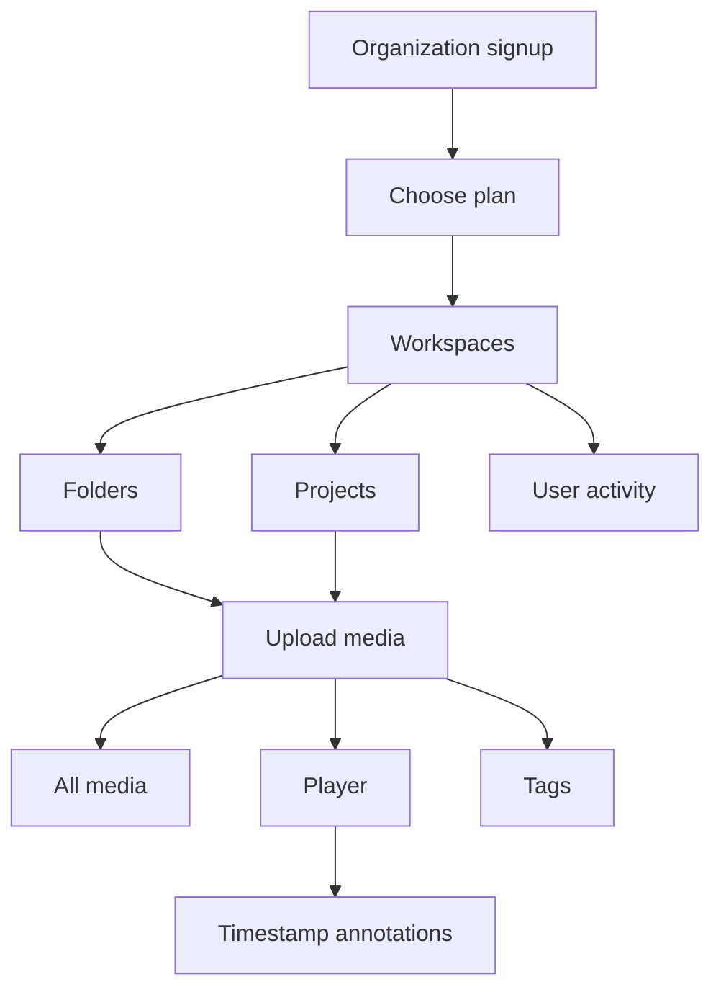

# Media Asset Management Platform

Noah is a **media asset management** workspace for production teams. Organizations register, pick a plan, then work inside **workspaces → projects → folders**. Media lives in those folders. **All media** shows everything in the active workspace. Review happens with **timestamped annotations** on the right of the player — the team recuts in their own NLE, not in Noah.

---

## Product flow

1. **Organization signup** — a company registers and becomes the first Super Admin.
2. **Plans** — Free, Team, or Business (storage, seats, annotation history).
3. **Workspaces** — after login, create workspaces for brands, shows, or clients.
4. **Projects & folders** — structure the library; upload video, image, and audio into folders.
5. **All media** — workspace-wide catalogue, filterable by type and tag.
6. **Player + annotations** — open a video or image. Comments sit on the right. A note at **05:30** highlights when the playhead hits 05:30; click the note to seek there. Picture is not edited in-app.
7. **Tags** — assign tags to any media.
8. **Activity** — uploads, tags, annotations, workspace and plan changes are logged.
9. **Roles**
   - **Viewer** — view library, play media, read notes. Cannot upload or comment.
   - **Collaborator / Editor / Admin / Super Admin** — upload and annotate.
   - **Admin / Super Admin** — manage members and the organization plan.



---

## Stack

- **Web:** Vite, React, TypeScript, MUI
- **API:** Node.js, Express, JWT
- **Demo store:** JSON file (swap for Postgres in production)

---

## Quick start

```bash
git clone https://github.com/OutreachSystem/Media-Asset-Management.git
cd Media-Asset-Management
npm run install:all
npm run dev:api    # terminal 1 — http://localhost:4000
npm run dev:web    # terminal 2 — http://localhost:5174
```

| Role | Email | Password |
| --- | --- | --- |
| Super Admin | `demo@noah.app` | `NoahDemo2026!` |
| Editor | `editor@noah.app` | `NoahDemo2026!` |
| Collaborator | `collab@noah.app` | `NoahDemo2026!` |
| Viewer | `viewer@noah.app` | `NoahDemo2026!` |

Open **Northwind Trailer — Cut 03** and jump to **05:30** (or click the note on the right) to see a timecode-locked annotation.

Docker: `docker compose up --build` → web [http://localhost:8080](http://localhost:8080)

See [ENVIRONMENT_SETUP.md](ENVIRONMENT_SETUP.md).

---

## API (selected)

| Method | Path | Purpose |
| --- | --- | --- |
| `POST` | `/api/v1/auth/signup` | Register organization |
| `POST` | `/api/v1/auth/login` | Sign in |
| `POST` | `/api/v1/org/plan` | Select Free / Team / Business |
| `POST` | `/api/v1/workspaces` | Create workspace |
| `POST` | `/api/v1/projects` | Create project |
| `POST` | `/api/v1/folders` | Create folder |
| `POST` | `/api/v1/media` | Upload (demo stub) |
| `GET` | `/api/v1/media` | Catalogue (workspace / folder / project / tag) |
| `POST` | `/api/v1/annotations` | Timecode comment |
| `GET` | `/api/v1/activity` | User activity |
| `PATCH` | `/api/v1/members/:id` | Change role |

Viewers receive `403` on upload and annotation routes.

---

This repository is a **working reference demo** of the Noah media workspace: org + plan, library structure, tagged media, role-aware comments, and activity. It is not the production monorepo (object storage, chunked upload, SSO, billing).
