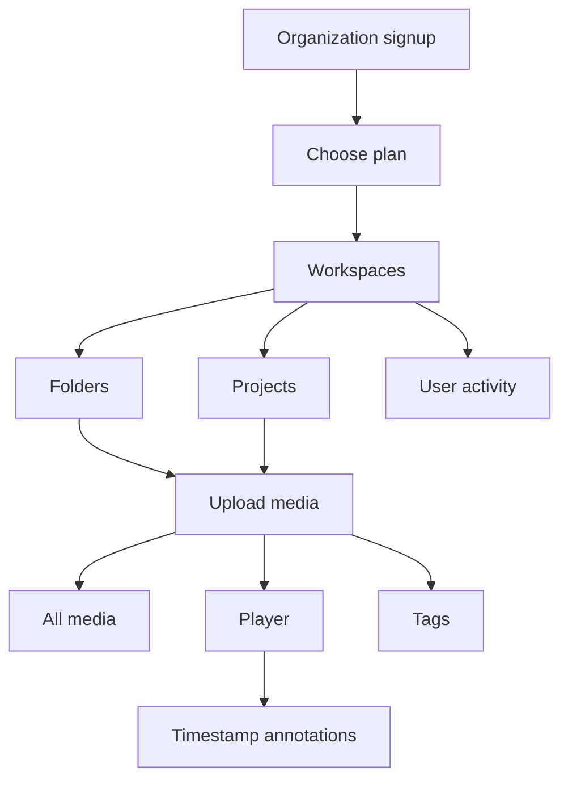
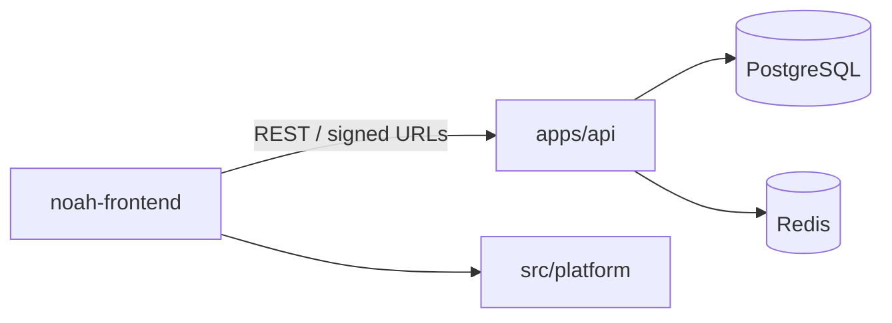

# Media Asset Management Platform

Noah is a **media asset management** workspace for production teams. Organizations register, pick a plan, then work inside **workspaces → projects → folders**. Media lives in those folders. **All media** shows everything in the active workspace. Review happens with **timestamped annotations** on the right of the player — the team recuts in their own NLE, not in Noah.

---

## Product flow

1. **Organization signup** — a company registers and becomes the first Super Admin.
2. **Plans** — Free, Team, or Business (storage, seats, annotation history).
3. **Workspaces** — after login, create workspaces for brands, shows, or clients.
4. **Projects & folders** — structure the library; upload video, image, and audio into folders.
5. **All media** — workspace-wide catalogue, filterable by type and tag.
6. **Player + annotations** — open a video or image. Comments sit on the right. A note at **05:30** highlights when the playhead hits 05:30; click the note to seek there. Picture is not edited in-app.
7. **Tags** — assign tags to any media.
8. **Activity** — uploads, tags, annotations, workspace and plan changes are logged.
9. **Roles**
   - **Viewer** — view library, play media, read notes. Cannot upload or comment.
   - **Collaborator / Editor / Admin / Super Admin** — upload and annotate.
   - **Admin / Super Admin** — manage members and the organization plan.



---

## Stack

- **Web:** Vite, React, TypeScript, MUI
- **API:** Node.js, Express (`apps/api`)

---

## System layout

Frontend and API ship independently. The web client talks to `apps/api` over REST.



### Frontend (`noah-frontend`)

Vite + React + TypeScript. Library routes live under `/home`; the admin console under `/platform`.

```
noah-frontend/
├── src/
│   ├── api/                          # HTTP clients
│   │   ├── client.ts                 # Axios instance, auth header, 401 handling
│   │   ├── auth.service.ts
│   │   ├── media.service.ts
│   │   ├── library.service.ts
│   │   ├── annotations.service.ts
│   │   ├── organizations.service.ts
│   │   ├── billing.service.ts
│   │   ├── share.service.ts
│   │   ├── usage.service.ts
│   │   └── users.service.ts
│   ├── auth/                         # Session, protected / guest routes
│   ├── pages/
│   │   ├── MarketingLandingPage.tsx
│   │   ├── LoginPage.tsx / SignUpPage.tsx
│   │   ├── OnboardingPlanPage.tsx
│   │   ├── DashboardPage.tsx         # All media, favorites, projects, shared
│   │   ├── FolderPage.tsx
│   │   ├── ProjectPage.tsx
│   │   ├── VideoPlayerPage.tsx       # Player + right-rail annotations
│   │   ├── TagsManagementPage.tsx
│   │   ├── UserActivitiesPage.tsx
│   │   ├── TrashPage.tsx
│   │   └── settings/
│   ├── layouts/
│   │   ├── DashboardLayout.tsx       # Sidebar + header + upload queue
│   │   ├── MediaViewerLayout.tsx
│   │   └── SettingsLayout.tsx
│   ├── components/
│   │   ├── dashboard/                # Sidebar, workspace switcher, upload, library grid
│   │   ├── media/                    # Player, timecode comments, drawing, collaborators
│   │   ├── settings/
│   │   ├── onboarding/               # Plan selection
│   │   └── landing/
│   ├── context/                      # Dashboard, upload manager, workspace state
│   ├── hooks/
│   ├── constants/                    # Permissions, roles, layout
│   ├── theme/
│   ├── styles/
│   ├── types/
│   ├── utils/
│   └── platform/                     # Super-admin console (plans, orgs, users, billing)
│       ├── pages/
│       ├── api/
│       └── layouts/
├── public/
└── package.json
```

Library navigation: **workspace → folder / project → all media → player**.

### API (`apps/api`)

Independent Express app: routes → controllers → services.

```
apps/api/
├── src/
│   ├── index.ts
│   ├── worker.ts
│   ├── config/
│   ├── middleware/
│   ├── routes/
│   │   ├── auth-routes.js
│   │   ├── organizations.js
│   │   ├── workspaces.js
│   │   ├── library.js
│   │   ├── media.js
│   │   ├── annotations.js
│   │   ├── tags.js
│   │   ├── share-routes.js
│   │   ├── stripe.js
│   │   ├── usage.js
│   │   └── platform.js
│   ├── controller/
│   │   ├── authController.js
│   │   ├── organizationsController.js
│   │   ├── workSpaceController.js
│   │   ├── libraryController.js
│   │   ├── mediaController.js
│   │   ├── annotationController.js
│   │   ├── tagController.js
│   │   ├── shareController.js
│   │   ├── stripe.controller.js
│   │   └── platform-*.controller.js
│   ├── services/
│   │   ├── auth-service.js
│   │   ├── workspace.service.js
│   │   ├── media.service.js
│   │   ├── libraryListService.js
│   │   ├── stripe.service.js
│   │   └── usage-meter.service.js
│   ├── lib/                      # RBAC policy, audit log
│   ├── utils/
│   └── templates/emails/
└── scripts/                      # Permission + access-level seeds
```

Domain map:

| Area | Routes | Controllers |
| --- | --- | --- |
| Identity & org | `auth-routes`, `organizations`, `users` | `authController`, `organizationsController`, `userController` |
| Library | `workspaces`, `library`, `media`, `tags` | `workSpaceController`, `libraryController`, `mediaController`, `tagController` |
| Review | `annotations`, `share-routes` | `annotationController`, `shareController` |
| Commercial | `stripe`, `usage` | `stripe.controller`, `usageController` |
| Platform admin | `platform` | `platform-*.controller` |

RBAC lives in `apps/api/src/lib/rbac-policy.js` (Viewer vs Collaborator / Editor / Admin / Super Admin).

---


## Quick start

```bash
git clone https://github.com/OutreachSystem/Media-Asset-Management.git
cd Media-Asset-Management
npm run install:all
npm run dev:api    # terminal 1 — http://localhost:4000
npm run dev:web    # terminal 2 — http://localhost:5174
```

| Role | Email | Password |
| --- | --- | --- |
| Super Admin | `demo@noah.app` | `NoahDemo2026!` |
| Editor | `editor@noah.app` | `NoahDemo2026!` |
| Collaborator | `collab@noah.app` | `NoahDemo2026!` |
| Viewer | `viewer@noah.app` | `NoahDemo2026!` |

Open **Northwind Trailer — Cut 03** and jump to **05:30** (or click the note on the right) to see a timecode-locked annotation.

Docker: `docker compose up --build` → web [http://localhost:8080](http://localhost:8080)

See [ENVIRONMENT_SETUP.md](ENVIRONMENT_SETUP.md).

---

## API (selected)

| Method | Path | Purpose |
| --- | --- | --- |
| `POST` | `/api/v1/auth/signup` | Register organization |
| `POST` | `/api/v1/auth/login` | Sign in |
| `POST` | `/api/v1/org/plan` | Select Free / Team / Business |
| `POST` | `/api/v1/workspaces` | Create workspace |
| `POST` | `/api/v1/projects` | Create project |
| `POST` | `/api/v1/folders` | Create folder |
| `POST` | `/api/v1/media` | Upload (demo stub) |
| `GET` | `/api/v1/media` | Catalogue (workspace / folder / project / tag) |
| `POST` | `/api/v1/annotations` | Timecode comment |
| `GET` | `/api/v1/activity` | User activity |
| `PATCH` | `/api/v1/members/:id` | Change role |

Viewers receive `403` on upload and annotation routes.

---

This repository is a **working reference demo** of the Noah media workspace: org + plan, library structure, tagged media, role-aware comments, and activity. It is not the production monorepo (object storage, chunked upload, SSO, billing).
